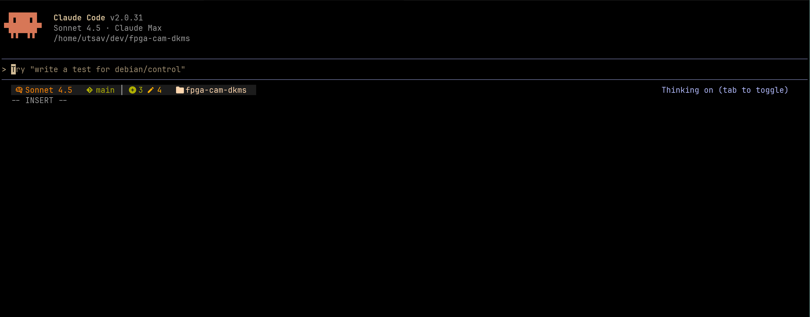

# Personal Claude Code Configuration

A comprehensive configuration framework for [Claude Code](https://claude.ai/code) that extends capabilities with custom skills, specialized agents, plugins, and persistent development philosophy.



## Prerequisites

- [just](https://github.com/casey/just) command runner (install via `brew install just` or `cargo install just`)
- Git

## Quick Start

### Installation

```bash
# Clone this repository
git clone https://github.com/UtsavBalar1231/claude-code-configs ~/dev/claude-code-configs
cd claude-code-configs

# Install configuration
just install

# View plugin installation commands
just plugins
```

Then run the plugin installation commands shown in Claude Code.

### Manual Installation (Alternative)

If you don't have `just` installed:

```bash
# Clone this repository
git clone https://github.com/UtsavBalar1231/claude-code-configs ~/dev/claude-code-configs

# Option 1: Symlink
ln -s ~/dev/claude-code-configs ~/.claude

# Install plugins in Claude Code:
/plugin marketplace add obra/superpowers-marketplace
/plugin install superpowers@superpowers-marketplace
/plugin install episodic-memory@superpowers-marketplace
```

## What's Included

### Custom Skills (5)
Skills are specialized workflows that trigger automatically based on your task:

- **ai-slop-detector** - Detect and fix AI-generated code quality issues
- **creating-skills** - Interactive wizard for building new Claude Code skills
- **debian-packaging** - Expert Debian package building (git-buildpackage, debhelper, lintian)
- **git-commit-composer** - Create well-structured conventional commits
- **linux-kernel-pro** - Linux kernel development and device driver expertise

### Specialized Agents (4)
Agents handle complex multi-step tasks autonomously:

- **code-reviewer** - Comprehensive code review (quality, security, best practices)
- **debugger** - Systematic debugging and root cause analysis
- **documentation-writer** - Technical documentation creation (README, API docs, guides)
- **test-writer** - Test suite development following TDD principles

### Plugins (2)

- **superpowers** - Advanced workflows including:
  - Brainstorming skill for design refinement
  - Test-driven development workflows
  - Systematic debugging frameworks
  - Code review automation
  - Git worktree management

- **episodic-memory** - Perfect recall of past conversations and projects
  - Restores context across sessions
  - Search previous decisions and solutions
  - Learn from past mistakes

### Custom Statusline
Python-based statusline with Gruvbox color scheme showing:
- Current model (Sonnet/Opus/Haiku)
- Git branch with diff statistics (+/-)
- Current directory
- Session cost and duration
- Line statistics with Nerd Font icons

### MCP Servers

This configuration includes two types of MCP (Model Context Protocol) servers:

#### Built-in Servers (Plugin-Provided)
These are automatically available after installing the superpowers plugin:

- **memory** - Persistent memory across sessions (use `#` shortcut)
- **documentation** - Documentation graph storage/retrieval
- **logic** - Logical reasoning and inference
- **time** - Temporal awareness and scheduling

#### External MCP Servers
Additional functionality through third-party MCP servers (require separate installation):

**Installed Servers:**
- **sequential-thinking** - Multi-step chain-of-thought problem solving
- **fetch** - Fetch and process web content as markdown
- **git** - Enhanced git operations and repository management
- **filesystem** - Read/write access to specified directories
- **Ref** - Search documentation from web, GitHub, and private repos
- **context7** - Library-specific documentation (MongoDB, Next.js, Supabase, etc.)

**Prerequisites for External Servers:**
- Node.js (for `npx` commands)
- Python with `uv` package manager (for `uvx` commands)
  ```bash
  # Install uv
  curl -LsSf https://astral.sh/uv/install.sh | sh
  ```

**Installation:**
```bash
# Install all external MCP servers
just mcp-install

# Or install manually:
claude mcp add sequential-thinking npx -y @modelcontextprotocol/server-sequential-thinking
claude mcp add fetch uvx mcp-server-fetch
claude mcp add git uvx mcp-server-git
claude mcp add filesystem npx -y @modelcontextprotocol/server-filesystem ~/Documents ~/Projects ~/dev
claude mcp add Ref npx ref-tools-mcp@latest
claude mcp add context7 https://mcp.context7.com/mcp --transport http

# Check server health
just mcp-status
```

**Note:** The episodic-memory plugin provides its own MCP server automatically - no separate installation needed.

### Session Hooks
- **session-start.sh** - Initializes environment variables and context

## Usage Guide

### Using Custom Skills

Skills activate automatically when your task matches their trigger patterns:

```bash
# ai-slop-detector triggers on: "review code", "code quality", "AI patterns"
# git-commit-composer triggers on: "commit", "create commit", "stage changes"
# debian-packaging triggers on: "Debian", ".deb", "dpkg", "debhelper"
```

Claude will announce which skill it's using and follow the workflow exactly.

### Leveraging Specialized Agents

Request agent help directly:

```bash
# "Can you review this implementation?" → code-reviewer agent
# "Help me debug this test failure" → debugger agent
# "Write API documentation for this module" → documentation-writer agent
# "Create tests for this feature" → test-writer agent
```

### Searching Past Conversations

```bash
/episodic-memory:search-conversations
# Or use the episodic-memory:remembering-conversations skill
```

### Customizing Configuration

Edit `settings.json` to:
- Enable/disable MCP servers
- Configure plugin settings
- Adjust statusline display
- Set file operation permissions

Edit `CLAUDE.md` to:
- Modify development philosophy
- Add project-specific conventions
- Update code style preferences
- Define custom workflows

## Development Philosophy

This configuration enforces core principles:

- **Fail fast** - Throw errors early, avoid silent failures
- **Ask when unclear** - Always clarify vague requirements
- **Explicit over implicit** - Prefer clear, obvious implementations
- **Readability first** - Code is read more than written
- **Test thoroughly** - Maintain coverage, run tests before commits

See `CLAUDE.md` for complete guidelines on error handling, code style, testing, and common workflows.

## Justfile Commands

Manage your installation with these commands:

```bash
# Installation
just install         # Install configuration (copies files to ~/.claude)
just install-symlink # Install using symlinks (advanced - changes sync automatically)
just uninstall       # Remove configuration (backs up to ~/.claude.backup.*)
just update          # Pull latest changes and reinstall

# Configuration
just plugins         # Show plugin installation commands
just status          # Check installation status and verify files

# MCP Servers
just mcp-install     # Install all external MCP servers
just mcp-status      # Check MCP server health (runs 'claude mcp list')
just mcp-check       # Verify MCP prerequisites (npx, uvx) are installed
```

Run `just` without arguments to see all available commands.

## Next Steps

1. Run `just status` to verify your installation
2. Review `CLAUDE.md` for detailed development philosophy
3. Explore skills in `/skills/` directory
4. Check agent capabilities in `/agents/` directory
5. Customize `settings.json` for your preferences
6. Try the brainstorming skill: `/superpowers:brainstorm`
7. Use `just update` to keep your configuration in sync

## Notes

- Skills and agents leverage MCP tools for enhanced capabilities
- The superpowers plugin provides mandatory workflows (TDD, debugging, verification)
- Episodic memory prevents reinventing solutions across sessions
- Configuration applies globally across all Claude Code projects
